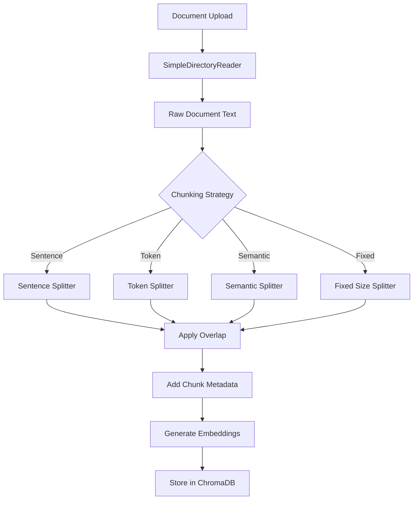

# Document Chunking Strategies

## Overview

Document chunking is a critical component of Retrieval-Augmented Generation (RAG) systems. It involves splitting large documents into smaller, manageable pieces (chunks) that can be efficiently stored, retrieved, and processed. The quality of chunking directly impacts retrieval accuracy and system performance.

## Why Chunking Matters

### The Problem with Large Documents

1. **Context Window Limits**: LLMs have token limits. Large documents exceed these limits, making it impossible to process entire documents at once.

2. **Retrieval Precision**: When searching for specific information, retrieving entire documents is inefficient. Smaller, focused chunks improve precision.

3. **Embedding Quality**: Embeddings work best with semantically coherent text segments. Large documents contain multiple topics, diluting embedding quality.

4. **Storage Efficiency**: Smaller chunks allow for more granular indexing and faster similarity searches.

### Impact on Retrieval Quality

Poor chunking strategies can lead to:
- **Information Loss**: Important context split across chunks
- **Low Precision**: Retrieving irrelevant chunks
- **Low Recall**: Missing relevant information due to poor boundaries
- **Performance Issues**: Too many or too few chunks affecting search speed

Good chunking strategies improve:
- **Retrieval Accuracy**: Better matching of queries to relevant content
- **Context Preservation**: Maintaining semantic coherence within chunks
- **System Performance**: Optimal chunk size for embedding and search operations

## Chunking Architecture



## Available Chunking Strategies

### 1. Sentence-Based Chunking (`sentence`)

**Default Strategy**

Splits documents at sentence boundaries, maintaining semantic coherence.

#### How It Works

1. Identifies sentence boundaries using punctuation marks (`.`, `!`, `?`)
2. Groups sentences into chunks up to the configured chunk size
3. Respects sentence boundaries (never splits mid-sentence)
4. Applies overlap between chunks

#### Configuration

```python
CHUNK_SIZE = 512        # Characters per chunk
CHUNK_OVERLAP = 50      # Overlap between chunks
CHUNK_STRATEGY = "sentence"
```

#### Advantages

- **Semantic Coherence**: Preserves complete thoughts and ideas
- **Natural Boundaries**: Respects linguistic structure
- **Good for**: General text documents, articles, reports, documentation

#### Disadvantages

- **Variable Chunk Sizes**: Sentences vary in length
- **Simple Detection**: Basic regex-based sentence detection may miss edge cases
- **Not Ideal for**: Code, structured data, tables

#### Example

**Input Text:**
```
Machine learning is transforming industries. It enables computers to learn from data. Deep learning uses neural networks. These networks have multiple layers.
```

**Output Chunks (chunk_size=50, overlap=10):**
```
Chunk 1: "Machine learning is transforming industries. It enables computers to learn from data."
Chunk 2: "It enables computers to learn from data. Deep learning uses neural networks."
Chunk 3: "Deep learning uses neural networks. These networks have multiple layers."
```

---

### 2. Token-Based Chunking (`token`)

Splits documents based on token count, ensuring chunks fit within LLM token limits.

#### How It Works

1. Tokenizes text using tiktoken (GPT-4 tokenizer: `cl100k_base`)
2. Groups tokens into chunks up to the configured token limit
3. Respects word boundaries when possible
4. Applies overlap between chunks

#### Configuration

```python
CHUNK_SIZE = 512        # Tokens per chunk
CHUNK_OVERLAP = 50      # Overlap in tokens
CHUNK_STRATEGY = "token"
```

#### Advantages

- **Token Accuracy**: Precise control over token count
- **LLM Compatibility**: Ensures chunks fit within model limits
- **Consistent Sizing**: More uniform chunk sizes
- **Good for**: LLM-focused applications, API integrations

#### Disadvantages

- **May Split Sentences**: Can break semantic units
- **Tokenization Overhead**: Requires tokenization step
- **Language Dependent**: Tokenization quality varies by language

#### Example

**Input Text:**
```
Artificial intelligence (AI) is revolutionizing technology. Machine learning algorithms can process vast amounts of data. Natural language processing enables human-computer interaction.
```

**Token Count**: ~35 tokens

**Output Chunks (chunk_size=20, overlap=5):**
```
Chunk 1: "Artificial intelligence (AI) is revolutionizing technology. Machine learning algorithms can process vast amounts of data."
Chunk 2: "Machine learning algorithms can process vast amounts of data. Natural language processing enables human-computer interaction."
```

---

### 3. Fixed-Size Chunking (`fixed`)

Splits documents into fixed-size chunks with configurable overlap.

#### How It Works

1. Divides text into fixed-size segments (character-based)
2. Attempts to break at word boundaries when possible
3. Applies overlap between consecutive chunks
4. Uses configurable separator for boundary detection

#### Configuration

```python
CHUNK_SIZE = 512        # Characters per chunk
CHUNK_OVERLAP = 50      # Overlap in characters
CHUNK_STRATEGY = "fixed"
CHUNK_SEPARATOR = " "    # Word boundary separator
```

#### Advantages

- **Predictable Sizes**: Consistent chunk sizes
- **Simple Implementation**: Easy to understand and debug
- **Fast Processing**: Minimal computational overhead
- **Good for**: Uniform documents, simple text processing

#### Disadvantages

- **May Split Words**: Can break words if separator not found
- **Semantic Breaks**: May split mid-sentence or mid-thought
- **Less Coherent**: Lower semantic coherence compared to sentence-based

#### Example

**Input Text:**
```
The quick brown fox jumps over the lazy dog. Machine learning is a subset of artificial intelligence.
```

**Output Chunks (chunk_size=30, overlap=5):**
```
Chunk 1: "The quick brown fox jumps over"
Chunk 2: "fox jumps over the lazy dog. Machine"
Chunk 3: "Machine learning is a subset of"
```

---

### 4. Semantic Chunking (`semantic`)

Groups text based on semantic similarity (simplified implementation).

#### How It Works

1. Uses sentence-based chunking as foundation
2. Groups semantically similar sentences together
3. Creates larger chunks for semantic coherence
4. Applies overlap between chunks

**Note**: Current implementation is simplified. For production use, consider:
- Computing embeddings for sentences
- Using clustering algorithms (e.g., K-means)
- Grouping by semantic similarity thresholds

#### Configuration

```python
CHUNK_SIZE = 512        # Base chunk size (doubled for semantic)
CHUNK_OVERLAP = 50      # Overlap between chunks
CHUNK_STRATEGY = "semantic"
```

#### Advantages

- **Semantic Coherence**: Groups related content together
- **Topic Preservation**: Maintains topic boundaries
- **Good for**: Complex documents, multi-topic content

#### Disadvantages

- **Computational Cost**: Requires embedding computation
- **Implementation Complexity**: More complex than other strategies
- **Current Limitation**: Simplified implementation uses sentence-based approach

#### Future Enhancements

- Real-time semantic similarity computation
- Adaptive chunk sizing based on content density
- Topic modeling integration

---

## Configuration Options

### Core Parameters

All strategies support these configuration parameters:

| Parameter | Type | Default | Description |
|-----------|------|---------|-------------|
| `CHUNK_SIZE` | int | 512 | Target chunk size (characters for sentence/fixed, tokens for token) |
| `CHUNK_OVERLAP` | int | 50 | Overlap between chunks |
| `CHUNK_STRATEGY` | str | "sentence" | Strategy type: "sentence", "token", "semantic", "fixed" |
| `CHUNK_SEPARATOR` | str | " " | Separator for fixed strategy |
| `MIN_CHUNK_SIZE` | int | 100 | Minimum chunk size (filters tiny fragments) |
| `MAX_CHUNK_SIZE` | int | 2048 | Maximum chunk size (safety limit) |

### Configuration File

Edit `backend/src/config.py`:

```python
# Document Chunking Configuration
CHUNK_SIZE = 512
CHUNK_OVERLAP = 50
CHUNK_STRATEGY = "sentence"
CHUNK_SEPARATOR = " "
MIN_CHUNK_SIZE = 100
MAX_CHUNK_SIZE = 2048
```

---

## Chunk Metadata

Each chunk includes comprehensive metadata for tracking and retrieval:

```python
{
    # Original document metadata
    "source": "document.pdf",              # Original filename
    "file_type": "application/pdf",       # MIME type
    "file_size": 12345,                   # File size in bytes
    "upload_type": "user_upload",         # Upload source
    
    # Chunk-specific metadata
    "chunk_index": 0,                     # Zero-based chunk index
    "total_chunks": 5,                    # Total chunks in document
    "chunk_size": 512,                    # Size of this chunk
    "chunk_strategy": "sentence",         # Strategy used
    "chunk_overlap": 50                   # Overlap amount
}
```

### Metadata Usage

- **chunk_index**: Identifies chunk position within document
- **total_chunks**: Indicates document fragmentation level
- **chunk_strategy**: Tracks which strategy was used (useful for analysis)
- **chunk_overlap**: Documents overlap configuration

---

## Best Practices

### 1. Choose the Right Strategy

**Use Sentence-Based When:**
- Processing natural language documents
- Semantic coherence is critical
- Documents have clear sentence structure
- General-purpose RAG applications

**Use Token-Based When:**
- Working with LLM APIs with strict token limits
- Need precise token count control
- Processing code or structured text
- API integration requirements

**Use Fixed-Size When:**
- Processing uniform documents
- Need predictable chunk sizes
- Simple text processing requirements
- Performance is critical

**Use Semantic When:**
- Complex multi-topic documents
- Need topic-aware chunking
- Advanced RAG applications
- (Note: Current implementation is simplified)

### 2. Optimize Chunk Size

**Small Chunks (100-256):**
- ✅ Higher precision
- ✅ Faster embedding generation
- ✅ More granular retrieval
- ❌ May lose context
- ❌ More chunks to manage

**Medium Chunks (256-512):**
- ✅ Balanced precision/recall
- ✅ Good context preservation
- ✅ Recommended default
- ✅ Works well for most use cases

**Large Chunks (512-1024):**
- ✅ Better context preservation
- ✅ Fewer chunks to manage
- ❌ Lower precision
- ❌ Slower embedding generation

### 3. Configure Overlap

**No Overlap (0):**
- Fast processing
- Risk of losing context at boundaries
- May miss information spanning chunks

**Small Overlap (10-20%):**
- Minimal overhead
- Some context preservation
- Good for most cases

**Medium Overlap (20-30%):**
- Better context preservation
- Recommended for complex documents
- Slight performance impact

**Large Overlap (30-50%):**
- Maximum context preservation
- Higher storage costs
- Slower processing
- Use only when necessary

### 4. Handle Edge Cases

**Very Short Documents:**
- System automatically handles documents smaller than `MIN_CHUNK_SIZE`
- Single chunk created if document is small enough
- No unnecessary fragmentation

**Very Long Documents:**
- System respects `MAX_CHUNK_SIZE` limit
- Prevents oversized chunks
- Ensures consistent processing

**Empty or Invalid Documents:**
- Empty documents are filtered out
- Invalid text is handled gracefully
- System continues processing other documents

---

## Performance Considerations

### Processing Speed

**Fastest to Slowest:**
1. Fixed-size chunking
2. Sentence-based chunking
3. Token-based chunking (tokenization overhead)
4. Semantic chunking (embedding computation)

### Storage Impact

**Chunk Count:**
- More chunks = more database entries
- More chunks = more embeddings to store
- Overlap increases storage requirements

**Example Calculation:**
```
Document: 10,000 characters
Chunk size: 512 characters
Overlap: 50 characters

Chunks without overlap: ~20 chunks
Chunks with overlap: ~22 chunks (10% increase)
```

### Retrieval Performance

**More Chunks:**
- ✅ More granular search results
- ✅ Better precision
- ❌ More database queries
- ❌ More results to process

**Fewer Chunks:**
- ✅ Faster queries
- ✅ Less processing
- ❌ Lower precision
- ❌ May retrieve irrelevant content

---

## Examples and Use Cases

### Example 1: Technical Documentation

**Scenario**: Processing API documentation

**Configuration:**
```python
CHUNK_SIZE = 512
CHUNK_OVERLAP = 50
CHUNK_STRATEGY = "sentence"
```

**Result**: Each API endpoint description stays intact, maintaining code examples and explanations together.

### Example 2: Research Papers

**Scenario**: Indexing academic papers

**Configuration:**
```python
CHUNK_SIZE = 1024
CHUNK_OVERLAP = 100
CHUNK_STRATEGY = "sentence"
```

**Result**: Larger chunks preserve section context, overlap ensures continuity between sections.

### Example 3: Code Documentation

**Scenario**: Processing code comments and documentation

**Configuration:**
```python
CHUNK_SIZE = 256
CHUNK_OVERLAP = 25
CHUNK_STRATEGY = "token"
```

**Result**: Token-based ensures compatibility with code tokenizers, smaller chunks for precision.

### Example 4: Chatbot Knowledge Base

**Scenario**: FAQ and support documentation

**Configuration:**
```python
CHUNK_SIZE = 400
CHUNK_OVERLAP = 40
CHUNK_STRATEGY = "sentence"
```

**Result**: Balanced chunks for quick retrieval, sentence boundaries preserve Q&A pairs.

---

## Troubleshooting Guide

### Problem: Chunks Too Small

**Symptoms:**
- Many tiny chunks
- Loss of context
- Poor retrieval quality

**Solutions:**
- Increase `CHUNK_SIZE`
- Increase `MIN_CHUNK_SIZE` to filter small chunks
- Check if documents are being over-split

### Problem: Chunks Too Large

**Symptoms:**
- Few chunks per document
- Low retrieval precision
- Embedding quality issues

**Solutions:**
- Decrease `CHUNK_SIZE`
- Use token-based strategy for better control
- Check `MAX_CHUNK_SIZE` limit

### Problem: Poor Retrieval Quality

**Symptoms:**
- Irrelevant chunks retrieved
- Missing relevant information
- Low precision/recall

**Solutions:**
- Adjust chunk size (try different sizes)
- Increase overlap for better context
- Try different strategy (sentence vs token)
- Review document structure

### Problem: Performance Issues

**Symptoms:**
- Slow document processing
- High storage usage
- Slow queries

**Solutions:**
- Reduce chunk overlap
- Use fixed-size strategy (fastest)
- Increase chunk size (fewer chunks)
- Optimize database indexing

### Problem: Context Loss at Boundaries

**Symptoms:**
- Incomplete answers
- Missing information at chunk edges
- Disconnected context

**Solutions:**
- Increase `CHUNK_OVERLAP`
- Use sentence-based strategy
- Review chunk boundaries
- Consider semantic chunking

---

## Advanced Topics

### Custom Chunking Strategies

To implement a custom chunking strategy:

1. Create a class inheriting from `ChunkingStrategy`
2. Implement `chunk_text()` method
3. Register in `create_chunking_strategy()` factory function

**Example:**
```python
class CustomChunkingStrategy(ChunkingStrategy):
    def chunk_text(self, text: str) -> List[str]:
        # Your custom chunking logic
        pass
```

### Dynamic Chunk Size

For adaptive chunking based on content:

1. Analyze document structure
2. Adjust chunk size dynamically
3. Use different strategies for different sections

### Multi-Strategy Chunking

Combine strategies:
- Use sentence-based for narrative sections
- Use token-based for code sections
- Use fixed-size for structured data

---

## Migration and Compatibility

### Existing Documents

- Existing documents in ChromaDB continue to work
- New uploads use new chunking system
- No migration required for existing data

### Changing Strategies

When changing chunking strategy:
1. Old documents remain with original chunking
2. New documents use new strategy
3. Consider re-indexing for consistency

### Backward Compatibility

- System handles documents without chunk metadata
- Defaults applied for missing metadata fields
- Graceful degradation for older documents

---

## References and Further Reading

- [LlamaIndex Documentation](https://docs.llamaindex.ai/)
- [ChromaDB Documentation](https://docs.trychroma.com/)
- [RAG Best Practices](https://www.pinecone.io/learn/retrieval-augmented-generation/)
- [Text Chunking Strategies](https://www.pinecone.io/learn/chunking-strategies/)

---

## Summary

Document chunking is a foundational component of RAG systems. The choice of chunking strategy and configuration directly impacts:

- **Retrieval Quality**: Better chunks = better retrieval
- **System Performance**: Optimal chunk size = efficient processing
- **User Experience**: Accurate retrieval = better answers

Choose your strategy based on:
1. Document type and structure
2. Retrieval requirements
3. Performance constraints
4. Use case specifics

Start with sentence-based chunking (default) and adjust based on your specific needs. Monitor retrieval quality and adjust chunk size and overlap as needed.

